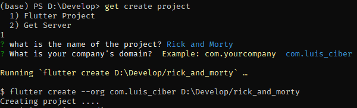

# Desarrollo rápido en Flutter con GetX

> 7 de marzo de 2021

## Lo primero, "el problema"

Recientemente he estado trabajando en muchos proyectos a la vez (algo que no me gusta hacer). Pero
por necesidad he tenido que dividir mi tiempo para poder realizar mis proyectos personales y además
cumplir con mis responsabilidades de estudio en la universidad.

Por este motivo he estado pensando: 

- ¿Cómo puedo desarrollar más rápido? 
- ¿Qué tiempo me toma desarrollar cada proyecto y cómo puedo hacer para disminuir ese tiempo?

En este post te mostraré como utilizo [GetX](https://pub.dev/packages/get){:target="_blank"} para desarrollar aplicaciones móviles utilizando [Flutter](https://flutter.dev/){:target="_blank"} y terminar las aplicaciones en el menor tiempo posible. A modo de ejemplo desarrollaremos una aplicación que se conectará a [The Rick and Morty API](https://rickandmortyapi.com/){:target="_blank"}, para mostrar de una manera práctica lo que trato de explicar.


## ¿Por qué GetX?

Primero quiero aclarar que no estoy tratando de defender el uso de un paquete u otro. Se que existe una "guerra santa" por determinar cuál es el mejor paquete para el manejo de estados en Flutter. Entre los cuáles se encuentra GetX. Pero no es mi objetivo defender a GetX en este aspecto, lo que quiero destacar es que GetX tiene todo lo que necesito para desarrollar una aplicación en Flutter **rápido**. 

GetX posee clases y funciones para:

* Manejo de estados.
* Administración de rutas (Navegación)
* Administración de depencencias (Inyección de dependencias)
* Cliente http para conexiones a API REST

Todo estas clases y funciones escritas de un modo que son fáciles de usar y lo más importante "sin
escribir tanto código", recuerda que lo que queremos es ahorrarnos tiempo, desarrollar **rápido**.

## Manos a la app

Como mencioné tiempo libre no es un recurso que tenga en abundancia así que he tomado prestado todo el diseño, los assets y los widgets de esta app [Rick and Morty](https://github.com/KathirvelChandrasekaran/rick_and_morty_flutter){:target="_blank"}. Tampoco podré abarcar en este post todos los aspectos relacionados con la utilización de GetX pero puedes revisar la documentación oficial de [GetX](https://pub.dev/packages/get){:target="_blank"} en español en este [link](https://github.com/jonataslaw/getx/tree/master/documentation/es_ES){:target="_blank"}. Al igual que la documentación de [The Rick and Morty API](https://rickandmortyapi.com/){:target="_blank"}.

Mi objetivo principal será reimplementar la app utilizando todo el ecosistema de GetX. **¡Comencemos!**

Lo primero es crear el proyecto, ya sabes:

```
> flutter create rick_and_morty
```

**¡PUES NO!**

Sucede que GetX también tiene un cli: [get_cli](https://pub.dev/packages/get_cli){:target="_blank"}, que nos permite generar código automáticamente para nuestra aplicación y este es un punto clave para reducir el tiempo de desarrollo. Contar con un generador de código es crucial para automatizar procesos como la creación de archivos, estructurar el proyecto, escribir lo que siempre escribimos cada vez que vamos a crear una página o widget, o establecer una conexión con una API.

> El desarrollador no debería tener que preocuparse por esas cosas, pienso que en la actualidad todos los frameworks deberían contar con generadores de código. Luego trataré de crear mis propios generadores de códigos para las herramientas que más utilizo e iré documentando el proceso en este blog.

Así que lo primero será instalar [get_cli](https://pub.dev/packages/get_cli){:target="_blank"}:

```
> flutter pub global activate get_cli 
```

Ahora sí creamos el proyecto:

```
> get create project
```




> Si estoy usando Windows 😅; cosas de la uni. Pero mi [Manjaro i3](https://www.manjaro.org/downloads/community/i3/){:target="_blank"} sigue aquí en mi PC listo para la acción.

Esta es la estructura inicial que nos genera el cli


Como se puede ver un sólo comando nos ha generado la vista inicial, el controlador para el manejo de estados, el binding para la inyección de dependencias, y los archivos `app_pages.dart` y `app_routes.dart` con la declaración de las rutas de las vistas. Todo muy bien estructurado para mantener la organización del proyecto.

> Si no entiendes que es **Vista**, **Controlador**, **Binding**, **Inyección de dependencias**, **Declaración de rutas** es porque debes revisar la documentación de [GetX](https://pub.dev/packages/get){:target="_blank"}. Además te recomiendo investigar más sobre [Clean Architecture](https://blog.cleancoder.com/uncle-bob/2012/08/13/the-clean-architecture.html){:target="_blank"} y como se aplica al desarrollo con Flutter.

## Hora de escribir código

### Main

`lib/main.dart`

```dart
import 'package:flutter/material.dart';

import 'package:get/get.dart';

import 'app/routes/app_pages.dart';

void main() {
  runApp(
    GetMaterialApp(
      title: "Application",
      initialRoute: AppPages.INITIAL,
      getPages: AppPages.routes,
      theme: ThemeData(
        fontFamily: 'Rick and Morty',
        brightness: Brightness.dark,
      ),
      debugShowCheckedModeBanner: false,
      defaultTransition: Transition.cupertino,
    ),
  );
}
```

Todo este código inicial ha sido generado por el cli, la única modificación que he tenido que hacer es establecer `theme` para cambiar las fuentes y que la app se vea por defecto en **modo dark**, además de cambiar el tipo de transición por defecto y quitar el banner que se muestra cuando las apps están en modo debug. No he tenido que tocar nada en `pubspec.yaml` para instalar nuevas dependencias, tampoco he tenido que modificar la plantilla que genera por defecto Flutter para añadir GetX al proyecto y todo esto es tiempo de desarrollo que me ahorra el cli al no tener que escribir código que realmente no es característico de mi aplicación sino del proceso de incluir y configurar los paquetes.

### Home View

`lib/app/modules/home/views/home_view.dart`

```dart
import 'package:flutter/material.dart';

import 'package:get/get.dart';

import '../controllers/home_controller.dart';

class HomeView extends GetView<HomeController> {
  @override
  Widget build(BuildContext context) => view;

  Widget get view => Scaffold(
        appBar: appBar,
        body: body,
      );

  Widget get appBar => AppBar(
        title: Text('RMDB'),
      );

  Widget get body => Center(
        child: Column(
          mainAxisAlignment: MainAxisAlignment.spaceEvenly,
          children: <Widget>[
            getColumnWithImageAndText(
              imageAsset: 'assets/images/characters.png',
              title: 'Characters',
              onTap: () {},
            ),
            getColumnWithImageAndText(
              imageAsset: 'assets/images/locations.png',
              title: 'Locations',
              onTap: () {},
            ),
            getColumnWithImageAndText(
              imageAsset: 'assets/images/episodes.png',
              title: 'Episodes',
              onTap: () {},
            ),
          ],
        ),
      );

  Widget getColumnWithImageAndText({
    String imageAsset,
    String title,
    Function onTap,
  }) {
    return GestureDetector(
      onTap: onTap,
      child: Column(
        children: <Widget>[
          Image.asset(
            imageAsset,
            width: 120,
            height: 120,
          ),
          Text(
            title,
            style: TextStyle(fontSize: 48),
          )
        ],
      ),
    );
  }
}
```

Esta sería la pantalla incial. Al usar `GetView<HomeController>` para la clase de la vista (en lugar de `StatelessWidget` o `StatefulWidget`). La vista automáticamente posee la propiedad `controller` que es una instancia de `HomeController` y es la utilizada para manejar el estado de la vista. Gracias al archivo `lib/app/modules/home/bindings/home_binding.dart` el controlador es "inyectado" o inicializado automáticamente para que esté listo para ser usado en la vista.

> No mostraré el código de este archivo ya que no he tenido necesidad de modificarlo, ha sido generado automáticamente por el cli, solo mostraré código de los archivos que tengan modificaciones. Al final del post dejaré el link del repo en github para que puedas descargar la app y revisar todo el código.

#### Un vistazo

{width="360px"}

Ya puedes ir entendiendo la lógica de lo que queremos hacer, ahora debemos generar tres páginas una para cada función de la app. Sería bastante pesado tener que escribir todos los archivos necesarios para solamente tener la plantilla de cada una de estas páginas y tomaría un tiempo valiosísimo. Una vez más get cli viene al rescate.

```
> get create page:characters
```

```
> get create page:locations
```

```
> get create page:episodes
```

Sin ni siquiera tener que revisar el código generado por get cli, puedes completar las funciones `onTap` de cada elemento para que al tocarlos la app nos dirija hacia la página correspondiente.

```dart
    ...
    import 'package:rick_and_morty/app/routes/app_pages.dart';
    ...
    Widget get body => Center(
        child: Column(
          mainAxisAlignment: MainAxisAlignment.spaceEvenly,
          children: <Widget>[
            getColumnWithImageAndText(
              imageAsset: 'assets/images/characters.png',
              title: 'Characters',
              onTap: () => Get.toNamed(Routes.CHARACTERS),
            ),
            getColumnWithImageAndText(
              imageAsset: 'assets/images/locations.png',
              title: 'Locations',
              onTap: () => Get.toNamed(Routes.LOCATIONS),
            ),
            getColumnWithImageAndText(
              imageAsset: 'assets/images/episodes.png',
              title: 'Episodes',
              onTap: () => Get.toNamed(Routes.EPISODES),
            ),
          ],
        ),
      );
    ...
```

Tres simples instrucciones es todo lo que se necesita y GetX cumple con su función y nos facilita la gestión de rutas y la navegación.

Ahora debemos implementar la UI para estas páginas. Pero .... primero hay que traer de la API los datos que van a mostrar.

### Accediendo a la API

Comenzaremos con el módulo de **Characters**. Lo primero es identificar el endpoint al que vamos a acceder y ver que datos nos devuelve. Este es el endpoint que utilizaremos `https://rickandmortyapi.com/api/character/` nos devuelve información sobre el endpoint más una lista de *characters*, pero ahora lo que queremos es identificar cuál es la estructura de cada *character* para poder crear el modelo y el servicio que vamos a usar para acceder a esos datos; así que utilizaremos este `https://rickandmortyapi.com/api/character/1` que nos devuelve un solo *character* y revisaremos su estructura.

```json
{
    "id":1,
    "name":"Rick Sanchez",
    "status":"Alive",
    "species":"Human",
    "type":"",
    "gender":"Male",
    "origin": {"name":"Earth (C-137)","url":"https://rickandmortyapi.com/api/location/1"},
    "location":{"name":"Earth (Replacement Dimension)","url":"https://rickandmortyapi.com/api/location/20"},"image":"https://rickandmortyapi.com/api/character/avatar/1.jpeg",
    "episode":[
        "https://rickandmortyapi.com/api/episode/1","https://rickandmortyapi.com/api/episode/2",
        "https://rickandmortyapi.com/api/episode/3","https://rickandmortyapi.com/api/episode/4",
        "https://rickandmortyapi.com/api/episode/5","https://rickandmortyapi.com/api/episode/6",
        "https://rickandmortyapi.com/api/episode/7","https://rickandmortyapi.com/api/episode/8",
        "https://rickandmortyapi.com/api/episode/9","https://rickandmortyapi.com/api/episode/10",
        "https://rickandmortyapi.com/api/episode/11","https://rickandmortyapi.com/api/episode/12",
        "https://rickandmortyapi.com/api/episode/13","https://rickandmortyapi.com/api/episode/14",
        "https://rickandmortyapi.com/api/episode/15","https://rickandmortyapi.com/api/episode/16",
        "https://rickandmortyapi.com/api/episode/17","https://rickandmortyapi.com/api/episode/18",
        "https://rickandmortyapi.com/api/episode/19","https://rickandmortyapi.com/api/episode/20",
        "https://rickandmortyapi.com/api/episode/21","https://rickandmortyapi.com/api/episode/22",
        "https://rickandmortyapi.com/api/episode/23","https://rickandmortyapi.com/api/episode/24",
        "https://rickandmortyapi.com/api/episode/25","https://rickandmortyapi.com/api/episode/26",
        "https://rickandmortyapi.com/api/episode/27","https://rickandmortyapi.com/api/episode/28",
        "https://rickandmortyapi.com/api/episode/29","https://rickandmortyapi.com/api/episode/30",
        "https://rickandmortyapi.com/api/episode/31","https://rickandmortyapi.com/api/episode/32",
        "https://rickandmortyapi.com/api/episode/33","https://rickandmortyapi.com/api/episode/34",
        "https://rickandmortyapi.com/api/episode/35","https://rickandmortyapi.com/api/episode/36",
        "https://rickandmortyapi.com/api/episode/37","https://rickandmortyapi.com/api/episode/38",
        "https://rickandmortyapi.com/api/episode/39","https://rickandmortyapi.com/api/episode/40",
        "https://rickandmortyapi.com/api/episode/41"
    ],
    "url":"https://rickandmortyapi.com/api/character/1",
    "created":"2017-11-04T18:48:46.250Z"
}
```

Es bastante información que procesar, solo fíjate en cuántos campos debe tener ese modelo, y luego debes escribir las funciones para obtener los datos de la API y parsear el json. Pero no haremos eso, porque queremos ahorrar tiempo, realizar estas acciones suele volverse un proceso mecánico, algo que podemos automatizar, y get cli lo hace.

Primero descargaremos exactamente la información que nos devolvió la API y la guardaremos en una carpeta, en mi caso yo la guardaré en `assets/models/character.json`. Luego viene la magia:

```
> get generate model with assets/models/character.json`
```

El cli nos genera automáticamente los archivos `lib/app/data/models/character_model.dart` y `lib/app/data/providers/character_provider.dart`. Esta vez si mostraré el código de estos archivos aunque no haya tenido que tocarlos para nada. Sólo para que puedas ver la *magia*.

`lib/app/data/models/character_model.dart`

```dart
class Character {
  int id;
  String name;
  String status;
  String species;
  String type;
  String gender;
  Origin origin;
  Origin location;
  String image;
  List<String> episode;
  String url;
  String created;

  Character(
      {id,
      name,
      status,
      species,
      type,
      gender,
      origin,
      location,
      image,
      episode,
      url,
      created});

  Character.fromJson(Map<String, dynamic> json) {
    id = json['id'];
    name = json['name'];
    status = json['status'];
    species = json['species'];
    type = json['type'];
    gender = json['gender'];
    origin = json['origin'] != null ? Origin.fromJson(json['origin']) : null;
    location =
        json['location'] != null ? Origin.fromJson(json['location']) : null;
    image = json['image'];
    episode = json['episode'].cast<String>();
    url = json['url'];
    created = json['created'];
  }

  Map<String, dynamic> toJson() {
    final data = <String, dynamic>{};
    data['id'] = id;
    data['name'] = name;
    data['status'] = status;
    data['species'] = species;
    data['type'] = type;
    data['gender'] = gender;
    if (origin != null) {
      data['origin'] = origin.toJson();
    }
    if (location != null) {
      data['location'] = location.toJson();
    }
    data['image'] = image;
    data['episode'] = episode;
    data['url'] = url;
    data['created'] = created;
    return data;
  }
}

class Origin {
  String name;
  String url;

  Origin({name, url});

  Origin.fromJson(Map<String, dynamic> json) {
    name = json['name'];
    url = json['url'];
  }

  Map<String, dynamic> toJson() {
    final data = <String, dynamic>{};
    data['name'] = name;
    data['url'] = url;
    return data;
  }
}
```

`lib/app/data/providers/character_provider.dart`

```dart
import 'package:get/get.dart';

import '../models/character_model.dart';

class CharacterProvider extends GetConnect {
  @override
  void onInit() {
    httpClient.defaultDecoder = (map) => Character.fromJson(map);
    httpClient.baseUrl = 'YOUR-API-URL';
  }

  Future<Response<Character>> getCharacter(int id) async =>
      await get('character/$id');
  Future<Response<Character>> postCharacter(Character character) async =>
      await post('character', character);
  Future<Response> deleteCharacter(int id) async =>
      await delete('character/$id');
}
```

Creo que estamos de acuerdo en que este simple comando nos ha ahorrado muchísimo tiempo y esfuerzo, tiempo que ahora aprovecharemos para enfocarnos en la UI y el manejo de estado de la app. Pero primero hay que hacerle modificaciones al provider, get cli no es adivino, debemos especificar la url de la API y además agregar una función extra para poder obtener una lista de *characters*, esta API también tiene paginación y esto es algo que debemos tener en cuenta.

`lib/api.dart`

```dart
abstract class API {
  static const BASE_URL = 'https://rickandmortyapi.com/api/';
}
```

Me gusta utilizar una clase para almacenar los distintos endpoints que utilizo en la app u otros valores constantes, en este caso guardamos la url base de la API.

Ahora vamos a modificar el `CharacterProvider` para configurar la url de la API y demás agregarle una función que nos permita obtener una lista de `Characters` con paginación. Quedaría de esta forma:

`lib/app/data/providers/character_provider.dart`

```dart
import 'package:get/get.dart';
import 'package:rick_and_morty/api.dart';

import '../models/character_model.dart';

class CharacterProvider extends GetConnect {
  @override
  void onInit() {
    httpClient.defaultDecoder = (map) => Character.fromJson(map);
    httpClient.baseUrl = API.BASE_URL;
  }

  Future<Response<List<Character>>> getCharacterPage({
    int pageNumber,
  }) async =>
      await get(
        'character/',
        query: {
          'page': '$pageNumber',
        },
        decoder: (list) => list['results']
            .map<Character>((e) => Character.fromJson(e))
            .toList(),
      );

  Future<Response<Character>> getCharacter(int id) async =>
      await get('character/$id');
  Future<Response<Character>> postCharacter(Character character) async =>
      await post('character', character);
  Future<Response> deleteCharacter(int id) async =>
      await delete('character/$id');
}
```

### CharactersView

Lo que corresponde ahora es modificar el controllador de `CharactersView` para que utilice el provider y obtenga los datos de la API.

`lib/app/modules/characters/controllers/characters_controller.dart`

```dart
import 'package:get/get.dart';
import 'package:rick_and_morty/app/data/models/character_model.dart';
import 'package:rick_and_morty/app/data/providers/character_provider.dart';

class CharactersController extends GetxController {
  var page = 0.obs;
  var isLoading = false.obs;

  final _characters = <Character>[].obs;
  List<Character> get characters => _characters.toList();

  final CharacterProvider characterProvider;

  CharactersController(this.characterProvider);

  @override
  void onInit() {
    ever(page, (_) => _getAllCharacters());
    page++;
    super.onInit();
  }

  Future<void> _getAllCharacters() async {
    isLoading.value = true;
    try {
      final response =
          await characterProvider.getCharacterPage(pageNumber: page.value);

      _characters.addAll(response.body);
    } catch (e) {
      print(e);
    }
    isLoading.value = false;
  }

  void next() => page++;
}
```

**¿Qué estamos haciendo aquí?**

Básicamente estamos utlizando `GetController` para almacenar el estado de la vista de manera reactiva, `GetController` tiene varias formas de hacer esto una vez más te recuerdo que si quieres conocer más sobre el tema es mejor leer la documentación oficial.

El controlador almacena el número de página que estamos visitando y la lista de elementos obtenidos de la API, utilizamos la función `ever` para activar la función `_getAllCharacters` cada vez que se realice un cambio en `page`. Una vez más GetX nos facilita las cosas para no tener que escribir "tanto código"; y la función `_getAllCharacters` simplemente obtiene los datos de la API utilizando el provider y los va agregando a la lista. Al utilizar el manejo de estados reactivo de GetX, cada modificación que se realiza en el controlador automáticamente actualiza la interfaz gráfica, nada de `setState` ni `StatefulWidget`, que son mecanismos que funcionan correctamente y son completamente válidos pero lo que estamos buscando es escribir menos código y ahorrar más tiempo.

Ahora ¿recuerdas cuando dije que la vista automáticamente carga su controlador al heredar de `GetView`? Pero ahora el controlador está recibiendo un parámetro que es el provider que necesita para acceder a la API. Pues vuelvo a otra pregunta: ¿recuerdas cuando hablé de inyección de dependencias?. Para eso son los dichosos **bindings** de GetX.

`lib/app/modules/characters/bindings/characters_binding.dart`

```dart
import 'package:get/get.dart';
import 'package:rick_and_morty/app/data/providers/character_provider.dart';

import '../controllers/characters_controller.dart';

class CharactersBinding extends Bindings {
  @override
  void dependencies() {
    Get.lazyPut<CharacterProvider>(
      () => CharacterProvider(),
    );

    Get.lazyPut<CharactersController>(
      () => CharactersController(
        Get.find(),
      ),
    );
  }
}
```

Para no ponernos técnicos los **bindings** se encargan de ir creando los objetos que necesita la app e ir colocándolos en su lugar. En cualquier parte de nuestro código podemos utilizar `Get.find()` para encontrar un objeto que necesitemos utilizar y que haya sido "inyectado" anteriormente, pero lo correcto para mantener nuestro código limpio es hacerlo de esta manera, cada objeto que necesite nuestra clase se declara que llegará a la clase como un parámetro en el constructor de la clase y luego utlizamos los bindings para ir contruyendo los objetos con los parámetros que necesitan.

> Sonó a trabalenguas, pero es mejor que se enrede la lengua y no el código. 😜

Finalmente solo nos resta implementar la vista, primero instalaremos un paquete que nos va a facilitar crear el *infinite scroll*

```
> get install lazy_load_scrollview
```

> Si, el get cli también instala paquetes, así que ya no es necesario que pierdas tiempo abriendo el `pubspec.yaml` y buscando la sección donde se declaran las dependencias para declarar el nuevo paquete y luego hacer `flutter pub get`

Con esto listo solo me resta mostrar el código: 

`lib/app/modules/characters/views/characters_view.dart`

```dart
import 'package:flutter/material.dart';

import 'package:get/get.dart';
import 'package:lazy_load_scrollview/lazy_load_scrollview.dart';

import '../controllers/characters_controller.dart';

class CharactersView extends GetView<CharactersController> {
  @override
  Widget build(BuildContext context) => view;

  Widget get view => Scaffold(
        appBar: appBar,
        body: body,
      );

  AppBar get appBar => AppBar(title: Text('Characters List'));

  Widget get body => Obx(
        () => LazyLoadScrollView(
          onEndOfPage: controller.next,
          isLoading: controller.isLoading.value,
          child: ListView.builder(
            itemCount: controller.characters.length,
            itemBuilder: (context, index) {
              final _character = controller.characters[index];

              return GestureDetector(
                behavior: HitTestBehavior.translucent,
                onTap: () {},
                child: Container(
                  margin: EdgeInsets.fromLTRB(16, 16, 24, 0),
                  child: Column(
                    children: <Widget>[
                      Row(
                        children: <Widget>[
                          Expanded(
                            flex: 2,
                            child: Image.network(
                              _character.image,
                              width: 64,
                              height: 64,
                            ),
                          ),
                          SizedBox(
                            width: 16,
                          ),
                          Expanded(
                            flex: 8,
                            child: Text(
                              _character.name,
                              style: TextStyle(fontSize: 24),
                            ),
                          ),
                        ],
                      ),
                      SizedBox(
                        height: 12,
                      ),
                      Divider(
                        height: 12,
                      ),
                    ],
                  ),
                ),
              );
            },
          ),
        ),
      );
}
```

Aquí nada nuevo, a excepción de `Obx` que pertenece a GetX, se utiliza para el manejo de estado reactivo. Para más información "Go to the doc".

#### Un vistazo

{width="360px"}

### CharacterDetailsView

Ahora corresponde crear la vista de detalles para cada *character*. Esta vez no necesitamos crear toda una página con su controllador y binding, solamente necesitamos una vista que recibirá como *argumento* el *character* que queremos visualizar.

```
> get create view:character_details on characters
```

Con esta instrucción generamos la vista, pero esta vez si tenemos que declararla en las rutas de la aplicación.

`lib/app/routes/app_routes.dart`

```dart
part of 'app_pages.dart';
// DO NOT EDIT. This is code generated via package:get_cli/get_cli.dart

abstract class Routes {
  static const HOME = _Paths.HOME;
  static const CHARACTERS = _Paths.CHARACTERS;
  static const CHARACTER_DETAILS = _Paths.CHARACTERS_DETAILS;
  static const LOCATIONS = _Paths.LOCATIONS;
  static const EPISODES = _Paths.EPISODES;
}

abstract class _Paths {
  static const HOME = '/home';
  static const CHARACTERS = '/characters';
  static const CHARACTERS_DETAILS = '/characters/details';
  static const LOCATIONS = '/locations';
  static const EPISODES = '/episodes';
}
```

`lib/app/routes/app_pages.dart`

```dart
import 'package:get/get.dart';

import 'package:rick_and_morty/app/modules/characters/bindings/characters_binding.dart';
import 'package:rick_and_morty/app/modules/characters/views/character_details_view.dart';
import 'package:rick_and_morty/app/modules/characters/views/characters_view.dart';
import 'package:rick_and_morty/app/modules/episodes/bindings/episodes_binding.dart';
import 'package:rick_and_morty/app/modules/episodes/views/episodes_view.dart';
import 'package:rick_and_morty/app/modules/home/bindings/home_binding.dart';
import 'package:rick_and_morty/app/modules/home/views/home_view.dart';
import 'package:rick_and_morty/app/modules/locations/bindings/locations_binding.dart';
import 'package:rick_and_morty/app/modules/locations/views/locations_view.dart';

part 'app_routes.dart';

class AppPages {
  static const INITIAL = Routes.HOME;

  static final routes = [
    GetPage(
      name: _Paths.HOME,
      page: () => HomeView(),
      binding: HomeBinding(),
    ),
    GetPage(
      name: _Paths.CHARACTERS,
      page: () => CharactersView(),
      binding: CharactersBinding(),
    ),
    GetPage(
      name: _Paths.CHARACTERS_DETAILS,
      page: () => CharacterDetailsView(),
    ),
    GetPage(
      name: _Paths.LOCATIONS,
      page: () => LocationsView(),
      binding: LocationsBinding(),
    ),
    GetPage(
      name: _Paths.EPISODES,
      page: () => EpisodesView(),
      binding: EpisodesBinding(),
    ),
  ];
}
```

Así va quedando nuestra declaración de rutas, de manera similar a como se hacer con las aplicaciones web.

Ahora podemos modificar el `onTap` que habíamos declarado vacío en `CharactersView` y hacer que cuando se haga *tap* en cada elemento nos dirija a la vista de detalles.

```dart
final _character = controller.characters[index];

...
onTap: () => Get.toNamed(
  Routes.CHARACTER_DETAILS,
  arguments: _character,
),
...

```

Recuerda que estamos generando la lista de *characters* y que cada elemento de la lista se va guardando en `_character`, pues lo único que debemos hacer en este caso es llamar a la nueva vista y pasarle esta variable como argumento usando Get. Otra manera de hacerlo sería pasando la variable directamente en el constructor de la vista, pero no podríamos utilizar el *enrutamiento por nombres*.

Ahora sí veamos el código de `CharacterDetailsView`:

`lib/app/modules/characters/views/character_details_view.dart`

```dart
import 'package:flutter/material.dart';

import 'package:get/get.dart';
import 'package:rick_and_morty/app/data/models/character_model.dart';
import 'package:rick_and_morty/app/widgets/table_row.dart';

class CharacterDetailsView extends GetView {
  final Character character = Get.arguments;

  @override
  Widget build(BuildContext context) => view;

  Widget get view => Scaffold(
        appBar: appBar,
        body: body,
      );

  AppBar get appBar => AppBar(
        title: Text('Character Details'),
      );

  Widget get body => SingleChildScrollView(
        child: Container(
          margin: EdgeInsets.all(24),
          child: Column(
            mainAxisAlignment: MainAxisAlignment.start,
            crossAxisAlignment: CrossAxisAlignment.start,
            children: <Widget>[
              Center(
                child: Image.network(
                  character.image,
                  width: 160,
                  height: 160,
                ),
              ),
              SizedBox(
                height: 24,
              ),
              Center(
                child: Text(
                  character.name,
                  style: TextStyle(fontSize: 32),
                ),
              ),
              SizedBox(
                height: 16,
              ),
              TableRowDetails(
                title: 'Status',
                value: character.status.toString().replaceAll('Status.', ''),
              ),
              TableRowDetails(
                title: 'Species',
                value: character.species.toString().replaceAll('Species.', ''),
              ),
              TableRowDetails(
                title: 'Gender',
                value: character.gender.toString().replaceAll('Gender.', ''),
              ),
              TableRowDetails(
                title: 'Origin',
                value: character.origin.name,
              ),
              TableRowDetails(
                title: 'Last Location',
                value: character.location.name,
              )
            ],
          ),
        ),
      );
}
```

Mucho código pero nanda novedoso, solamente fíjate en esta línea:

```dart
final Character character = Get.arguments;
```

¿Recuerdas cuándo pasamos el *character* que queríamos visualizar como argumento de la vista? Pues así es como lo recuperamos.

Este widget auxiliar lo copié tal cual del repo de [Rick and Morty](https://github.com/KathirvelChandrasekaran/rick_and_morty_flutter){:target="_blank"}, recuerda que estamos reimplementando su app, puedes ir a dejarle una ⭐️ como muestra de agradecimiento, ya yo he dejado la mía.

`lib/app/widgets/table_row.dart`

```dart
import 'package:flutter/material.dart';

class TableRowDetails extends StatelessWidget {
  TableRowDetails({
    @required this.title,
    @required this.value,
  });

  final String title, value;

  @override
  Widget build(BuildContext context) {
    return Row(
      children: <Widget>[
        Expanded(
          flex: 5,
          child: Container(
            margin: EdgeInsets.all(4),
            padding: EdgeInsets.all(16),
            color: Colors.blueGrey,
            child: Text(
              addNewLineCharacter(value),
              style: TextStyle(fontSize: 24),
              textAlign: TextAlign.center,
              maxLines: 2,
            ),
          ),
        ),
        Expanded(
          flex: 5,
          child: Container(
            margin: EdgeInsets.all(4),
            padding: EdgeInsets.all(16),
            color: Colors.blueGrey,
            child: Text(
              value,
              style: TextStyle(fontSize: 24),
              textAlign: TextAlign.center,
              maxLines: 2,
            ),
          ),
        ),
      ],
    );
  }

  String addNewLineCharacter(String result) {
    if (result.length <= 23 && result.allMatches(' ').length <= 2) {
      return title;
    } else {
      return title + '\n';
    }
  }
}
```

#### Un vistazo

{width="360px"}


### Tarea para la casa

Ahora corresponde continuar con el resto de las pantallas. Pero sería un proceso repetitivo y explicar nuevamente el proceso en un post se torna aburrido tanto para ti que me lees como para mí que estoy escribiendo. Así que haremos lo siguiente puedes terminar tu mismo el resto de la app y así prácticas lo aprendido. Aunque de todos modos dejaré el código de la app terminada al final del post y una pequeña sorpresa que comentaré al final, sigue leyendo.

### Conclusiones

El tiempo es lo más valioso que tenemos, incluso cuando lo aprovechamos en cosas productivas: como trabajar en nuestros proyectos personales, programar, estudiar, etc. Debemos asegurarnos de que lo estamos empleando de la mejor forma posible, los programadores somos adictos a optimizar procesos, de querer automatizar las cosas, de evitarle trabajo mecánico a las personas y dárselo a las máquinas, para que el ser humano tenga tiempo para el trabajo creativo. Si hacemos eso en distintas industrias, ayudando a personas de distintas profesiones, podemos hacerlo también para nosotros mismos, para optimizar nuestro tiempo, quitarnos de encima el trabajo mecánico y dedicarnos a la parte creativa de nuestros proyectos. 

Este ha sido sólo un pequeño esfuerzo que hago para compartir como trato de lograr esto, todavía me queda mucho por aprender pero estaré compartiendo todo lo que aprenda a través de este este blog, espero que te haya sido de utilidad este primer post y si conoces alguna forma de ahorrar más tiempo de desarrollo puedes dejar un comentario al final del post.

---

Acá está el link para que puedas descargar todo el código terminado de la app desde Github:

[https://github.com/correaleyval/rick_and_morty](https://github.com/correaleyval/rick_and_morty){:target="_blank"}

Y la sorpresa es que este proyecto ha sido desarrollado utilizando [Flutter 2.0](https://developers.googleblog.com/2021/03/announcing-flutter-2.html){:target="_blank"}. Por lo que lo he compilado para web y puedes verlo funcionando en este sitio: 

[https://flutter-rickandmorty.netlify.app/](https://flutter-rickandmorty.netlify.app/){:target="_blank"}