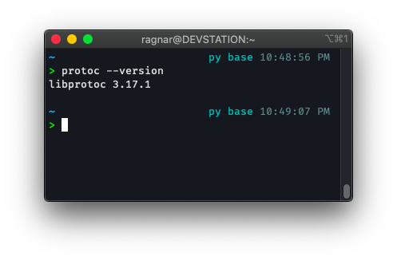
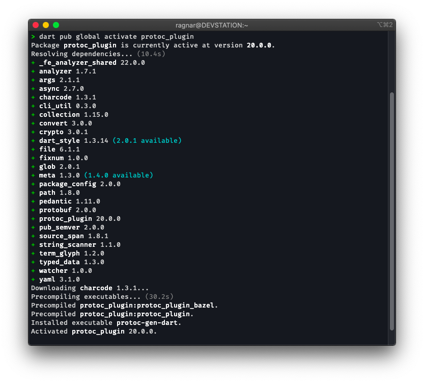
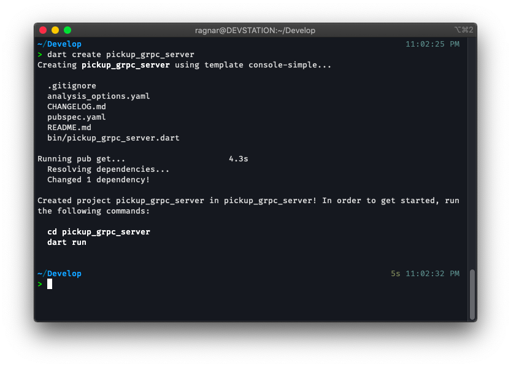
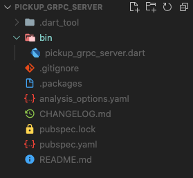
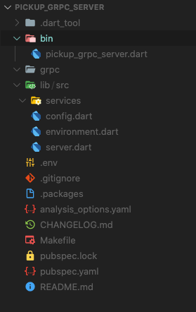
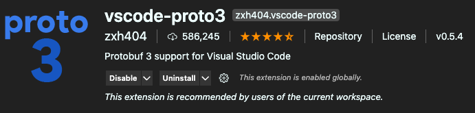

# Usando Dart en Backend y Frontend con gRPC

> 13 de junio de 2021

## Lo primero, "el problema" 😉

Pues esta vez no partiremos de un problema sino más bien de un deseo. A todo desarrollador le gusta la idea de poder programar todo lo que pueda utilizando un solo lenguaje. La búsqueda de un lenguaje "full stack" con el que puedas hacer de todo es comparáble con la búsqueda de la "teoría fundamental de la física", donde los físicos buscan una teoría que les permita unificar la teoría de la relatividad y la teoría cuántica, los programadores buscan un lenguaje que les permita desarrollar backend y frontend sin tener que cambiarse el chip mental de un lenguaje a otro.

Durante un tiempo estuve programando en NodeJS y React y sentí esa sencación de haber encontrado en Javascript ese lenguaje full stack que me permitía hacer de todo, sin embargo luego de comenzar a trabajar con Dart y Flutter me enamoré del lenguaje, Dart es simplemente elegante, lo veo como un híbrido que toma lo mejor de Javacript, C#, Java e incluso C++ y a pesar de que las mezclas no son buenas pues esta mezcla si que ha salido bien. Flutter cada día crece más como framework para el desarrollo frontend tanto de aplicaciones móviles como webapps; y Dart es bien conocido por ser un lenguaje multiplataforma que se puede utilizar tanto para desarrollar apps con Flutter como para desarrollar aplicaciones de consola y servicios web, sin embargo esta última característica no ha sido tan explotada.

## ¿Puede ser Dart el nuevo lenguaje full stack que estoy buscando?

Pues una vez que comencé a tener dominio del lenguaje comencé a experimentar con él para el desarrollo de servicios web y la verdad es que la experiencia al principio fué lo típico del niño que tiene un juguete nuevo, pero a la hora de realizar proyectos reales no fué para nada gratificante. Carece de frameworks que faciliten el trabajo, muy poca documentación sobre tareas típicas de un backend como conectarse a una base de datos, el manejo de las peticiones HTTP se puede tornar complejo cuando intentas contruir una API REST para un proyecto del mundo real y mantener una API REST escrita en Dart puede volverse costoso en tiempo, esfuerzo y puede costarte unos cuántos pelos de la cabeza cuando te topas con un bug.

Sin embargo recientemente conocí a [gRPC](https://grpc.io){:target="_blank"} y mi idea sobre cómo se contruye un servicio web cambió por completo. 


Veamos lo que dice la web oficial sobre gRPC:

> En gRPC, una aplicación cliente puede llamar directamente a un método en una aplicación de servidor en una máquina diferente como si fuera un objeto local, lo que facilita la creación de aplicaciones y servicios distribuidos. Como en muchos sistemas RPC, gRPC se basa en la idea de definir un servicio, especificando los métodos que se pueden llamar de forma remota con sus parámetros y tipos de retorno. En el lado del servidor, el servidor implementa esta interfaz y ejecuta un servidor gRPC para manejar las llamadas de los clientes. En el lado del cliente, el cliente tiene un código auxiliar (denominado simplemente cliente en algunos idiomas) que proporciona los mismos métodos que el servidor.

Si usted entiende lo escrito anteriormente pues **FELICITACIONES** 🥳, porque yo no entendí nada cuando lo leí, así que fuí directamente a ver los ejemplos de código de cómo se implementaba esto y me encontré con que se podía implementar en distintos lenguajes y que tanto cliente como servidor podían estar implementados en lenguajes diferentes y comunicarse entre ellos, nada nuevo hasta ahora. Sin embargo noté que Dart se encontraba entre los lenguajes que se podía utilizar para implementar tanto servidor como cliente y vi una oportunidad de volver a probar con Dart para construir servicios web.

## Conociendo más a gRPC

Comencé a revisar código de ejemplos y los tutoriales de la web oficial y primeramente noto que todo el servicio se especifíca utilizando archivos `.proto`, donde se utiliza [Protocol Buffers](https://developers.google.com/protocol-buffers){:target="_blank"} para definir primero los tipos de datos y los servicios y luego un compilador (transpilador) genera el código automáticamente tanto de cliente como de servidor para el lenguaje que escojas 🤯. Otra vez volví a sentir esa sensación de niño con juguete nuevo.

Noto también que no hay que definir urls, ni controladores, ni middlewares, solo defines tu servicio en `.proto`, generas para el lenguaje que desees, implementas los servicios en el servidor y en el cliente es solamente llamar a las funciones que ya ha generado `protoc`. Así que pensé 🤔: 

> "Esto es demasiado fácil de usar como para no usarlo. Esto me va a permitir usar Dart en el backend sin realizar practicamente ningún esfuerzo, y en las apps que implemente con Flutter es sólo llamar a las funciones, adios serialización de json y llamadas POST, GET, PUT, etc a urls distintas, es sólo llamar a una función"

gRPC además nos trae otras bondades como la utilización de HTTP/2 como protocolo de comunicación que permite una comunicación bidireccional y más efectiva; y al usar protobuf los datos entre cliente y servidor se envían en formato raw binario, disminuyendo el consumo de datos y la carga de la red. 

Esta infromación la puedes leer en la web oficial, en este post mi intención es mostrarte cómo utilizar gRPC para desarrollar un servicio web completo para una aplicación real, que será utilizada en un proyecto real, del mundo real, para aportarle valor a un negocio real. Insisto en el término real porque es muy fácil usar una tecnología nueva creando una simple ToDo List y ya decir que esa tecnología es lo máximo, no me gusta hacer ese tipo de cosas, sino sirve para proyectos grandes pues simplemente no sirve.

Por la mediana complejidad del proyecto y la necesidad de ir explicando cada detalle iré dividiendo este post en varias partes, en esta primera parte comenzaremos por lo básico, partiremos desde la instalación de las herramientas necesarias hasta crear un primer servicio y conectar una app cliente (de consola en este caso) al servicio que hemos creado. Al finalizar la implementación de todo el backend dejaré publicado el código del servidor y de una app desarrollada en Flutter que consumirá el servicio.

## Terminó la charla, time to code 👨‍💻.

### Lo primero, instalar `protoc`

Esto como siempre depende del sistema operativo que estés utilizando, las [instrucciones de instalación](https://grpc.io/docs/protoc-installation/){:target="_blank"} puedes encontrarlas en la web oficial de [gRPC](https://grpc.io/docs/protoc-installation/){:target="_blank"}.

* Linux, using apt or apt-get, for example:

```bash
$ sudo apt install -y protobuf-compiler
```

* MacOS, using [Homebrew](https://brew.sh/){:target="_blank"}:

```bash
$ brew install protobuf
```

También puedes descargarte el último release desde [Github](https://github.com/protocolbuffers/protobuf/releases){:target="_blank"}

Una vez tienes `protoc` instalado y te asegures de que puedes ejecutarlo desde la consola:



Lo que debes hacer es instalar el plugin de `protoc` para Dart, por defecto ya viene con los plugins de C++, Java, C#, etc. Pero para Dart aún debemos instalar el plugin para este lenguaje:

```bash
$ dart pub global activate protoc_plugin
```



Por supuesto he asumido que ya tenías Dart o Flutter instalado y configurado en el `PATH`.

### Crear proyecto de Dart

```bash
dart create pickup_grpc_server
```

> Lo que está despues de `create` es el nombre del proyecto



Abres el proyecto con tu editor de código favorito (VSCode 😉) y debes tener una estuctura de archivos como esta:



Agregaremos unas carpetas más y archivos que utilizaremos luego a medida que vayamos implementando el sistema. 

* Primero una carpeta que llamaremos `grpc` donde irán los archivos `.proto` que definen nuestro servicio API. En muchos tutoriales que he visto e incluso en la documentación oficial nombran esta carpeta como `protos` el nombre de la carpeta no es realmente importante, puedes usar cualquiera sin embargo prefiero llamarle grpc porque luego ese mismo nombre se utiliza para localizar los archivos que son generados por `protoc`. 

* Una carpeta `lib/src/services` donde irá la implementación de nuestros servicios, con gRPC solamente nos preocupamos por implementar los servicios que se encargarán de obtener los datos y enviarlos al cliente a través de funciones simples del lenguaje, más adelante veremos cómo. 

* Tres archivos:

  `lib/src/server.dart`: donde irá el punto de entrada encargado de levantar el servidor gRPC. 
  
  `lib/src/environment.dart`: donde implementaremos una clase encargada de cargar el entorno de desarrollo o de producción, esta clase tendrá variables que almacenarán cosas como número del puerto en que corre el server, dirección de la base de datos que se va a utilizar, llaves secretas para encriptado de contraseñas, etc. 
  
  `lib/src/config.dart`: en este archivo implementaremos una función que se va a encargar de configurar todo el entorno y de la inyección de dependencias.

* Un archivo `.env`, el clásico `.env` que se utiliza para declarar variables de entorno, vamos a recordar que Dart puede ser compilado en un archivo autoejecutable, o sea al estilo C, que lo compilas y lo corres en cualquier sistema incluso si no tiene Dart instalado. Entonces usando este archivo `.env` nos aseguramos de poder cambiar algunos parámetros del sistema sin necesidad de modificar el código.

* Un archivo `Makefile` será utilizado para poder ejecutar el comando encargado de generar los archivos desde proto sin necesidad de estar escribiendo todo el comando completo, además de otros comandos de utilidad. Es más sencillo si automatizamos un poco usando `make`.

Como puedes ver no nos tomaremos el diseño del sistema a la ligera ya que queremos construir algo que pueda ser escalable y sostenible en el tiempo. Queremos contruir un sistema robusto utilizando Dart como se haría con cualquier otro lenguaje y framework de renombre como ASP.NET, Django, Ruby on Rails, etc.

Esta sería la nueva estructura de archivos que nos va quedando.



### Definiendo los servicios con `protobuf`.

Para este proyecto iremos definiendo varios servicios en distintos archivos, pero como este es el primer post y aún no hemos visto nada de código para crear el server comenzaremos con algo básico y práctico. Implementaremos un servicio que nos devolverá información sobre el estado del sistema.

Para ello utilizaremos el paquete de Dart: [system_info](https://pub.dev/packages/system_info){:target="_blank"}

```bash
$ dart pub add system_info
```

Y vamos a crear el archivo `grpc/system.proto`:

> Si usas VSCode te recomiendo instalar la extensión [`vscode-proto3`](https://marketplace.visualstudio.com/items?itemName=zxh404.vscode-proto3){:target="_blank"}



`grpc/system.proto`

```proto3
syntax = "proto3";

message Status {
  string kernelArchitecture = 1;
  string kernelName = 2;
  string kernelVersion = 3;
  string operatingSystemName = 4;
  string operatingSystemVersion = 5;
  repeated Processor processors = 6;
  double totalPhysicalMemory = 7;
  double freePhysicalMemory = 8;
  double totalVirtualMemory = 9;
  double freeVirtualMemory = 10;
  double virtualMemorySize = 11;
}

message Processor {
  string architecture = 1;
  string name = 2;
  string socket = 3;
  string vendor = 4;
}
```

Esto es lo primero que vamos a escribir en nuestro archivo `.proto`, comenzamos por definir los tipos de datos, en gRPC cada `message` que definimos será traducido en un tipo de clase del lenguaje que seleccionemos, los objetos de estas clases son los que almacenarán la información que se va a transmitir entre el servidor y el cliente, una analogía sería cuando definimos los modelos en una API REST usando un framework, en este caso los `messages` son nuestros modelos. En este caso en particular tenemos un `message Status` que contiene varios atributos de tipo string y double, algo que nos resulta completamente familiar, también tenemos un atributo de tipo `repeated Processor`, la palabra `repeated` se utiliza para representar arreglos o listas, y luego tenemos otro `message Processor` que basicamente almacena la infromación de un procesador y como podemos ver `Status` podrá contener información sobre varios procesadores.

Fíjese que cada instrucción debe terminar con el clásico `;` y que a cada atributo se le asigna un número positivo, no es necesario que se asignen en orden aunque es recomendable, estos números son utilizados para la codificación y decodificación de los mensajes. A diferencia de json, protobuf no envía información sobre el nombre de los atributos sino que solo envía su número asignado y su valor, el código que se genera se encarga automaticamente de codificar y descodificar esta información. Tenga en cuenta esto ya que esto le permite cambiar facilmente el nombre de cualquier campo sin que esto afecte el funcionamiento del sistema, sin embargo una vez que el sistema se encuentre en producción no podrá cambiar los valores numéricos asignados a cada campo.

Finalmente esta instrucción `syntax = "proto3";` es solo para decir la versión de protobuf que queremos utilizar, hasta el momento de escribir este post proto3 es la última versión y recomendada.

Ahora pasaremos a definir el servicio que devolverá la información del sistema. Lo definimos dentro del mismo archivo:

`grpc/system.proto`

```proto3
syntax = "proto3";

message Status {
  string kernelArchitecture = 1;
  string kernelName = 2;
  string kernelVersion = 3;
  string operatingSystemName = 4;
  string operatingSystemVersion = 5;
  repeated Processor processors = 6;
  double totalPhysicalMemory = 7;
  double freePhysicalMemory = 8;
  double totalVirtualMemory = 9;
  double freeVirtualMemory = 10;
  double virtualMemorySize = 11;
}

message Processor {
  string architecture = 1;
  string name = 2;
  string socket = 3;
  string vendor = 4;
}

message Memory {
  double totalPhysicalMemory = 7;
  double freePhysicalMemory = 8;
  double totalVirtualMemory = 9;
  double freeVirtualMemory = 10;
  double virtualMemorySize = 11;
}

service SystemService {
  rpc getSystemInfo(NoParams) returns (Status);
  rpc getMemoryStatus (NoParams) returns (Memory);
}

message NoParams {}
```

Decidí agregar otro `message Memory` para poder mostrar que un servicio puede contener más de una función o método. En este caso hemos definido el servicio `SystemService` que posee dos métodos, uno para obtener el estado general del sistema: `getSystemInfo` y otro para obtener solamente el estado de la memoria `getMemoryStatus`. La definición de cada método comienza con la palabra `rpc` seguida de su nombre y entre paréntesis él parámetro de la función que debe ser un `message`, si te fijas he tenido que definir otro `message NoParams` para poder especificar que estos métodos no van a recibir ningún parámetro; aquí no tenemos algo como `void` pero podemos declarar un `message` vacío para simularlo. Después viene la palabra `returns` y entre paréntesis especificamos el tipo de `message` que se va a devolver. Una vez más el `;` está presente después de cada declaración y puedes ver que se utiliza `service` para definir un servicio algo similar a como mismo utilizamos `class` para definir una clase en la mayoria de los lenguajes de POO.

Ya con esto tenemos nuestro primer servicio definido, ahora es momento de generar el código para Dart e implementar el servicio, si te fijas esto solo define el servicio y los tipos de datos, aún nos falta implementar esas funciones y construir los objetos que tendrán esa información.

## Traducir e implementar 🛠

