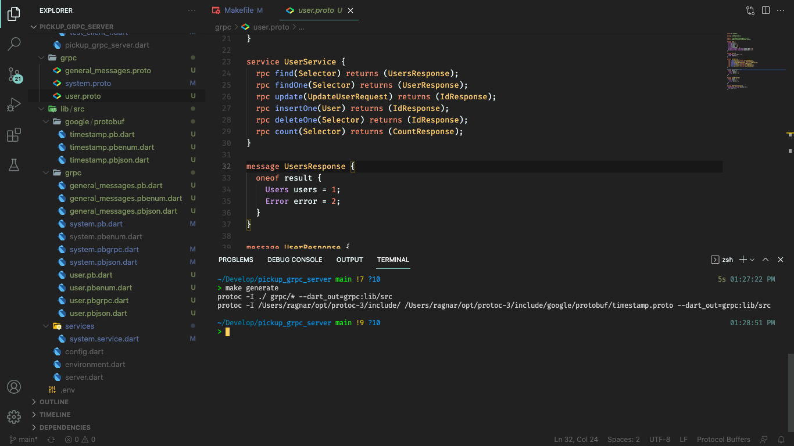
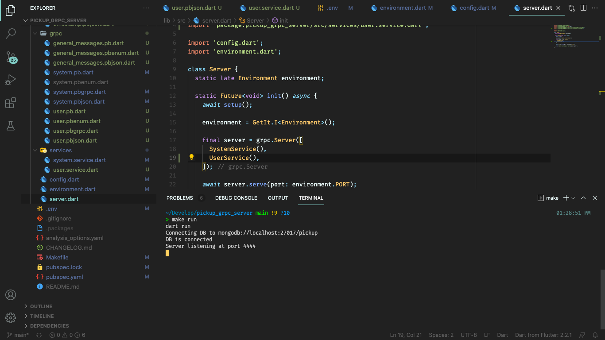

# Usando Dart en Backend con gRPC (Users CRUD)

> 15 de junio de 2021

## Lo primero, remember...

En el [post anterior](/blog/2021/06/13/usando-dart-backend-frontend-grpc) implementamos un servidor gRPC utilizando Dart y creamos un servicio básico encargado de enviarnos información sobre el estado del sistema.

Nuestra labor esta vez será crear un servicio que nos permita almacenar información sobre los usuarios del sistema, el típico CRUD.

## Seleccionando la base de datos

Estuve buscando información para determinar que gestor de base de datos utilizar en el sistema, finalmente seleccioné MongoDB para almacenar la información; nada en contra de las bases de datos relacionales, lo que sucede es que no encontré paquetes robustos y con buena documentación para establecer una conexión con otro tipo de base de datos. Para SQLite si hay muy buena documentación y paquetes debido a que SQLite se utiliza también en el desarrollo de aplicaciones móviles. Perfectamente se pudiera utilizar SQLite para desarrollar nuestro servicio web pero pienso que sería una mejor práctica utilizar un sistema de gestión de bases de datos que sea más popular en el desarrollo backend así que la mejor opción parece ser MongoDB.

Para establecer una conexión con MongoDB usando Dart emplearemos el paquete [mongo_dart](https://pub.dev/packages/mongo_dart){:target="\_blank"}.

```bash
$ dart pub add mongo_dart
```

Este paquete cuenta con muy buena documentación en [su página de pub.dev](https://pub.dev/packages/mongo_dart){:target="\_blank"}

Como nos proponemos implementar un crud para el almacenamiento de datos de usuarios incluyendo contraseñas, de antemano sabemos que no es una buena práctica guardar contraseñas en nuestra base de datos usando texto plano; lo correcto es almacenar las contraseñas usando algún mecanismo de cifrado. Para lograr esto usaremos el paquete [crypto](https://pub.dev/packages/crypto){:target="\_blank"} que se describe como: "A set of cryptographic hashing functions implemented in pure Dart", justo lo que necesitamos.

```bash
$ dart pub add crypto
```

## Definiendo `messages` y `services`

Una vez más vamos a definir primero los `services` y `messages` utilizando los archivos `.proto`.

Primero he creado un archivo `grpc/general_messages.proto` en este archivo colocaremos `messages` de uso general que serán luego utilizados en otros archivos.

```proto
syntax = "proto3";

message NoParams {}

message Selector {
  map<string, string> selector = 1;
  int32 skip = 2;
  int32 limit = 3;
}

message Error {
  string message = 1;
}

message IdResponse {
  oneof result {
    string id = 1;
    Error error = 2;
  }
}

message CountResponse {
  oneof result {
    int32 count = 1;
    Error error = 2;
  }
}
```

> Esta manera de estructurar los mensajes y los archivos con los que definimos la API depende por completo de usted, no tiene que seguir de manera estricta la forma en que he organizado los archivos, esto es solo una propuesta que hago para que pueda comenzar a experimentar usted mismo y luego puede hacerle las modificaciones que estime convenientes.

`message NoParams`: Este ya lo conocemos del [post anterior](/blog/2021/06/13/usando-dart-backend-frontend-grpc) se utiliza para especificar que un servicio no va a recibir datos.

`message Selector`: Este mensaje es muy importante, será utilizado para pasarle parámetros a las funciones encargadas de realizar búquedas en la base de datos. Primero tenemos un `map<string, string>` que será utilizado para el filtrado ej: `{'username': 'usergrpc'}`, con esto solicitamos información del usuario **usergrpc**, y así podemos filtrar cualquier tipo de información. Cuando vea la implementación de las funciones encargadas de realizar búquedas podrá ver por qué decidí crear este mensaje de esta forma. Luego tenemos un campo `skip` y un campo `limit` estos se utilizan para lograr la paginación de los datos.

> He decidido nombrar a los campos del mismo modo que se nombran en las consultas que se realizan a MongoDB, de este modo es más sencillo entender lo que se está haciendo y mapear una función del servicio API con operaciones específicas en la base de datos. Todo lo que muestro es el resultado de varia horas de experimentación, probando diferentes maneras de estructurar la API para facilitar la implementación y mejorar la eficiencia de los servicios.

`message Error`: Lo utilizaremos para enviar mensajes de error al cliente.

`message IdResponse`: Este mensaje es utilizado para esos casos donde solamente necesitamos retornar un **id**. Aquí si tenemos algo nuevo, la palabra clave `oneof`, esto nos permite definir que nuestro mensaje tiene uno de los campos que son especificados entre llaves, en este caso podemos retornar un **id** o un **error** (fíjese que se ha utilizado el `message Error` dentro de `IdResponse` **proto** admite composición de mensajes; esto se ve reflejado luego cuando generamos el código y nos facilita muchísimo trabajo),

`message CountResponse`: Similar a `IdResponse` pero lo utilizaremos para obtener la cantidad de documentos (registros) que tenga una colección (tabla) determinada.

`grpc/user.proto`

```proto
syntax = "proto3";

import "grpc/general_messages.proto";
import "google/protobuf/timestamp.proto";

message User {
  string id = 1;
  string name = 2;
  string email = 3;
  string phone = 4;
  string password = 5;
  google.protobuf.Timestamp created_date = 6;
  google.protobuf.Timestamp updated_date = 7;
}

message Users {
  repeated User users = 1;
  int32 count = 2;
}

service UserService {
  rpc find(Selector) returns (UsersResponse);
  rpc findOne(Selector) returns (UserResponse);
  rpc update(UpdateUserRequest) returns (IdResponse);
  rpc insertOne(User) returns (IdResponse);
  rpc deleteOne(Selector) returns (IdResponse);
  rpc count(Selector) returns (CountResponse);
}

message UsersResponse {
  oneof result {
    Users users = 1;
    Error error = 2;
  }
}

message UserResponse {
  oneof result {
    User user = 1;
    Error error = 2;
  }
}

message UpdateUserRequest {
  map<string, string> selector = 1;
  User user = 2;
}
```

gRPC tiene una característica peculiar, los archivos que utilizamos para definir la API también pueden ser utilizados como documentación de la misma, resulta sencillo leer estos archivos y entender cómo funciona la API y que tipo de valores recibe cada método como parámetro y que tipo de valores retorna. Dicho esto, creo que resulta redundante volver a explicar lo que estamos haciendo aquí en este archivo, solamente voy a referirme a un detalle que si es nuevo:

`import "google/protobuf/timestamp.proto";`

Esta instrucción importa un archivo que contiene la definición de un `message` para crear campos de tipo `Timestamp`, el tipo de datos típico que utilizamos cuando queremos guardar información sobre la fecha y la hora en que se realiza una operación determinada en la base de datos. Podemos ver en el `message User` cómo utilizamos esta definición para los campos `created_date` y `updated_date`. Este archivo viene incluido junto con la instalación de protoc.

Sin embargo utilizar este archivo implica que debemos realizar un cambio en `Makefile` para que nos genere el código correspondiente a esta nueva definición que hemos incluido.

`Makefile`

```Makefile
.PHONY: generate
generate:
	protoc -I ./ grpc/* --dart_out=grpc:lib/src
	protoc -I /Users/ragnar/opt/protoc-3/include/ /Users/ragnar/opt/protoc-3/include/google/protobuf/timestamp.proto --dart_out=grpc:lib/src

.PHONY: run
run:
	dart run
```

No he encontrado una mejor forma de hacer esto, tienes que encontrar en que carpeta se ha instalado protoc en tu sistema y cambiar `/Users/ragnar/opt/protoc-3` por la carpeta correspondiente, para que puedas generar el código correspondiente a esta definición.

### make generate

Hora de generar código:

```bash
$ make generate
```

> Recuerda que estamos utilizando `make` para facilitarnos las cosas de lo contrario tendrías que escribir los dos comandos que son utilizados para generar el código y puede volverse un trabajo tedioso (además de aburrido).



Fíjate en la imagen que se han generado los nuevos archivos con la implementación de gRPC para las nuevas definiciones que hemos creado. Incluso los archivos de `Timestamp` que se han generado en una carpeta independiente: `google/protobuf`.

## Hands to code 👨‍💻

Pregunta de control: **¿Qué es lo que tenemos que hacer una vez que generamos el código de los archivos `.proto`?**

Implementar esto:

```proto
service UserService {
  rpc find(Selector) returns (UsersResponse);
  rpc findOne(Selector) returns (UserResponse);
  rpc update(UpdateUserRequest) returns (IdResponse);
  rpc insertOne(User) returns (IdResponse);
  rpc deleteOne(Selector) returns (IdResponse);
  rpc count(Selector) returns (CountResponse);
}
```

Solamente implementar el servicio. Hemos definido varios mensajes en archivos diferentes, usamos una lib externa para representar fecha y hora y solamente tenemos que implementar las funciones del servicio que hemos declarado, todo lo demás ya está hecho, esta es una de las razones por la que me ha gustado tanto utilizar esta tecnología. Si leíste [mi primer post](http://localhost:8000/blog/2021/03/07/desarrollo-rápido-en-flutter-con-getx/) verás la importancia que le doy a ahorrar tiempo de desarrollo al máximo y cómo me gusta utilizar generadores de código para evitar tener que escribir código que se torna monótono y repetitivo. gRPC lo ha logrado, ha logrado liberarnos de esa tarea pesada y aburrida de escribir el código de los modelos y las funciones para codificar y descodificar la información enviada entre cliente y servidor, ha logrado liberarnos de tener que definir distintas URLs con distintos métodos HTTP para poder especificarle al backend lo que queremos hacer. **This is the future.**

Terminado el discurso motivacional es momento de mostrar código:

`lib/src/service/user.service.dart`

```dart
import 'package:pickup_grpc_server/src/grpc/general_messages.pb.dart';
import 'package:grpc/src/server/call.dart';
import 'package:pickup_grpc_server/src/grpc/user.pbgrpc.dart';

class UserService extends UserServiceBase {
  @override
  Future<CountResponse> count(ServiceCall call, Selector request) {
    // TODO: implement count
    throw UnimplementedError();
  }

  @override
  Future<IdResponse> deleteOne(ServiceCall call, Selector request) {
    // TODO: implement deleteOne
    throw UnimplementedError();
  }

  @override
  Future<UsersResponse> find(ServiceCall call, Selector request) {
    // TODO: implement find
    throw UnimplementedError();
  }

  @override
  Future<UserResponse> findOne(ServiceCall call, Selector request) {
    // TODO: implement findOne
    throw UnimplementedError();
  }

  @override
  Future<IdResponse> insertOne(ServiceCall call, User request) {
    // TODO: implement insertOne
    throw UnimplementedError();
  }

  @override
  Future<IdResponse> update(ServiceCall call, UpdateUserRequest request) {
    // TODO: implement update
    throw UnimplementedError();
  }
}
```

Nada interesante que mostrar aún, solo mantén la imagen de este código en tu mente porque luego iré mostrando solamente la implementación de cada una de las funciones que conforman a `UserService` por separado con una pequeña explicación.

Pero primero hay que configurar la base de datos:

`.env`

```env
PORT=4444
MONGODB_URI=mongodb://localhost:27017/pickup
SECRET=secretkeytoencryptpasswords
```

Modificamos la clase `Environment` para que soporte las nuevas variables de entorno:

`lib/src/environment.dart`

```dart
import 'package:dotenv/dotenv.dart' show load, env;

class Environment {
  final int PORT;
  final String MONGODB_URI;
  final String SECRET;

  Environment({
    required this.PORT,
    required this.MONGODB_URI,
    required this.SECRET,
  });

  factory Environment.development() {
    load();
    return Environment(
      PORT: int.parse(env['PORT'] ?? '9000'),
      MONGODB_URI: env['MONGODB_URI'] ?? 'mongodb://localhost:27017/pickup_dev',
      SECRET: env['SECRET'] ?? 'secret',
    );
  }

  factory Environment.production() {
    load();
    return Environment(
      PORT: int.parse(env['PORT'] ?? '9000'),
      MONGODB_URI: env['MONGODB_URI'] ?? 'mongodb://localhost:27017/pickup_dev',
      SECRET: env['SECRET'] ?? 'secret',
    );
  }
}
```

Configuramos la base de datos:

`lib/src/config.dart`

```dart
import 'package:get_it/get_it.dart';
import 'package:mongo_dart/mongo_dart.dart';

import 'environment.dart';

Future<void> setup() async {
  final getIt = GetIt.instance;

  final environment = Environment.development();

  final db = Db(environment.MONGODB_URI);
  print('Connecting DB to ${environment.MONGODB_URI}');
  await db.open();
  print('DB is connected');

  getIt.registerSingleton<Environment>(
    environment,
  );

  getIt.registerSingleton<Db>(
    db,
  );
}
```

Y agregamos el nuevo servicio que hemos creado al servidor gRPC:

`lib/src/server.dart`

```dart
import 'package:get_it/get_it.dart';
import 'package:grpc/grpc.dart' as grpc;
import 'package:pickup_grpc_server/src/services/system.service.dart';
import 'package:pickup_grpc_server/src/services/user.service.dart';

import 'config.dart';
import 'environment.dart';

class Server {
  static late Environment environment;

  static Future<void> init() async {
    await setup();

    environment = GetIt.I<Environment>();

    final server = grpc.Server([
      SystemService(),
      UserService(),
    ]);

    await server.serve(port: environment.PORT);

    print('Server listening at port ${server.port}');
  }
}
```

Como puede ver en la siguiente imagen, ya podemos conectarnos a la base de datos (tengo la base de datos instalada en local), y el servidor levanta correctamente. El único problema es que aún no hemos implementado las funciones de `UserService`, si intentamos llamarlas desde una app cliente obtendríamos un mensaje de `UnimplementedError`.



Ahora que tenemos todo configurado vamos a enfocarnos solamente en acceder a la base de datos para realizar las operaciones solicitadas y devolver información.

## MongoDB Users CRUD

Creamos campos dentro de `UserService` para acceder a la base de datos y crear la collection **users**:

```dart
import 'package:get_it/get_it.dart';
import 'package:mongo_dart/mongo_dart.dart';
import 'package:pickup_grpc_server/src/grpc/general_messages.pb.dart';
import 'package:grpc/src/server/call.dart';
import 'package:pickup_grpc_server/src/grpc/user.pbgrpc.dart';

class UserService extends UserServiceBase {
  final Db db = GetIt.I<Db>();
  late DbCollection users;

  UserService() : super() {
    users = db.collection('users');
  }

...
```

### CREATE

```dart
import 'package:pickup_grpc_server/src/utils/utils.dart';
import 'package:pickup_grpc_server/src/google/protobuf/timestamp.pb.dart' as google;
  ...
  @override
  Future<IdResponse> insertOne(ServiceCall call, User request) async {
    try {
      if (request.name.isEmpty) {
        return IdResponse(
          error: Error(message: 'Field name is required'),
        );
      }

      request.createdDate =
          google.Timestamp.fromDateTime(DateTime.now().toUtc());
      request.updatedDate =
          google.Timestamp.fromDateTime(DateTime.now().toUtc());

      if (request.password.isNotEmpty) {
        request.password = hashPassword(request.password);
      }

      final result = await users.insertOne(
        request.toProto3Json() as Map<String, dynamic>,
      );

      return IdResponse(
        id: (result.document?['_id'] as ObjectId).toHexString(),
      );
    } catch (e) {
      return IdResponse(
        error: Error(
          message: e.toString(),
        ),
      );
    }
  }
  ...
```

Examinemos rápidamente esta función encargada de realizar la operación de crear un usuario.
Primero fíjate en que request es un objeto de tipo `User`, como hemos especificado en el archivo `user.proto`:

```proto
service UserService {
  ...
  rpc insertOne(User) returns (IdResponse);
  ...
}
```

Entonces comprobamos que el nombre de usuario no sea vacío, en caso de que sea vacío retornamos un error:

```dart
if (request.name.isEmpty) {
  return IdResponse(
    error: Error(message: 'Field name is required'),
  );
}
```

Establecemos los valores de `createdDate` y `updatedDate` para este nuevo usuario que estamos creando:

```dart
request.createdDate = google.Timestamp.fromDateTime(DateTime.now().toUtc());
request.updatedDate = google.Timestamp.fromDateTime(DateTime.now().toUtc());
```

Ciframos la contraseña del usuario:

```dart
if (request.password.isNotEmpty) {
  request.password = hashPassword(request.password);
}
```

Aquí si vamos a detenernos un momento, seguro te estás preguntando de donde salió `hashPassword`:

`lib/src/utils/utils.dart`

```dart
import 'dart:convert';

import 'package:crypto/crypto.dart';
import 'package:get_it/get_it.dart';
import 'package:mongo_dart/mongo_dart.dart';

import '../environment.dart';

SelectorBuilder fixId(Map<String, String> map) {
  var selector = where;

  if (map['_id'] != null) {
    final id = ObjectId.fromHexString(map['_id']!);
    map.remove('_id');

    if (map.keys.isNotEmpty) selector = selector.raw(map);

    selector = selector.id(id);
  }

  if (map['id'] != null) {
    final id = ObjectId.fromHexString(map['id']!);
    map.remove('id');

    if (map.keys.isNotEmpty) selector = selector.raw(map);

    selector = selector.id(id);
  }

  return selector;
}

String hashPassword(String password) {
  final environment = GetIt.I<Environment>();
  final secret = utf8.encode(environment.SECRET);
  final pass = utf8.encode(password);

  final hmacSha256 = Hmac(sha256, secret);
  final digest = hmacSha256.convert(pass);

  return digest.toString();
}
```

Ahí está `hashPassord`, lo que hace es cifrar una cadena (string) usando **sha256** y una clave que ya hemos declarado en el environment. 

La primera función `fixId` la utilizaremos más adelante para el filtrado en las operaciones de **READ**, **UPDATE**, esta función es necesaria porque al utilizar MongoDB no podemos emplear el campo `id` sino que es `_id`, y no podemos simplemente pasarle una cadena sino que debe ser un `ObjectId`, esta función nos permite solicitar filtrado por `{'id': 'abcdefg'}` desde el cliente para que el cambio de `id` -> `_id` sea transparente.

Continuamos con el análisis de `UserService.insertOne`:

```dart
      final result = await users.insertOne(
        request.toProto3Json() as Map<String, dynamic>,
      );

      return IdResponse(
        id: (result.document?['_id'] as ObjectId).toHexString(),
      );
```

Puedes percatarte de que el nombre de la función del servicio es el mismo nombre que se utiliza en MongoDB para realizar la misma operación, es un pequeño tip que te recomiendo para que te sea más fácil organizar todo y entender el código, cuando ejecutas estas funciones del lado del cliente puedes abstraerte de todo el mecanismo de gRPC y hacerte idea de que estas realizando operaciones directas en una base de datos MongoDB.

La función `insertOne` requiere como parámetro un objeto similar a `json`, un `Map`; para lograr esto todo lo que tenemos que hacer es llamar a la función `toProto3Json` y hacerle un cast a `Map<String, dynamic>`. Esta función `toProto3Json` es generada por `protoc` y no es necesario que te preocupes por su implementación.

Finalmente retornamos una respuesta con el **id** del nuevo usuario que hemos creado:

```dart
(result.document?['_id'] as ObjectId).toHexString(),
```

Esta operación es requerida porque como dije anteriormente MongoDB nos devuelve en ese campo `_id` un objeto de tipo `ObjectId`, lo que deseamos retornar no es el objeto sino su representación en cadena: `toHexString`.

### READ

La función `find` encargada de retornar una lista de usuarios:

```dart
  @override
  Future<UsersResponse> find(ServiceCall call, Selector request) async {
    try {
      final selector = fixId(request.selector);
      final result = await users
          .find(
            selector
                .excludeFields(
                  ['password'],
                )
                .skip(request.skip)
                .limit(request.limit),
          )
          .toList();

      final count = await users.count(request.selector);

      return UsersResponse(
        users: Users(
          users: result.map(
            (e) => User()
              ..mergeFromProto3Json(
                e,
                ignoreUnknownFields: true,
              )
              ..id = (e['_id'] as ObjectId).toHexString(),
          ),
          count: count,
        ),
      );
    } catch (e) {
      return UsersResponse(
        error: Error(
          message: e.toString(),
        ),
      );
    }
  }
```

Primero lidiar con el cambio de **id**:

```dart
final selector = fixId(request.selector);
```

Realizar la consulta a la base de datos:

```dart
        final result = await users
          .find(
            selector
                .excludeFields(
                  ['password'],
                )
                .skip(request.skip)
                .limit(request.limit),
          )
          .toList();
```

Excluimos el campo `password` ya que el valor las contraseñas no debe ser retornado en una consulta a la base de datos; y te puede percatar que ya está programado el mecanismo necesario para tener paginación, utilizamos exactamente el mismo que se utiliza en MongoDB. Todas estas funciones pertenecen al paquete [mongo_dart](https://pub.dev/packages/mongo_dart){:target="_blank"}. Lo que estamos taratando de hacer es simplemente mapear cada función de MongoDB con una función gRPC de nuestro servicio, ya en este punto todo depende del dominio que tengas para trabajar con la base de datos; gRPC sólo está actuando como un medio de comunicación entre el cliente y el servidor.

Retornar los resultados:

```dart
      final count = await users.count(request.selector);

      return UsersResponse(
        users: Users(
          users: result.map(
            (e) => User()
              ..mergeFromProto3Json(
                e,
                ignoreUnknownFields: true,
              )
              ..id = (e['_id'] as ObjectId).toHexString(),
          ),
          count: count,
        ),
      );
```

La función `count` nos dice cuántos registros cumplen con la condición, este valor lo retornamos dentro de la respuesta que enviamos al cliente para que lo pueda utilizar mostrando datos sobre la paginación que se está haciendo, cuando escriba el código del cliente mostraré más detalles.

El resto es mapear la información que nos devuelve la base de datos como una lista de objetos tipo `User`, para esto nos valemos de la función `mergeFromProto3Json` que realiza la operación inversa de `toProto3Json`; y además le pasamos el parámetro `ignoreUnknownFields: true` para que no nos de un error al intentar ubicar el campo `_id` dentro del objeto `User`.

La función `findOne` realiza una operación similar a `find` pero solamente retorna un usuario:

```dart
  @override
  Future<UserResponse> findOne(ServiceCall call, Selector request) async {
    try {
      final selector = fixId(request.selector);
      final result = await users.findOne(
        selector.excludeFields(
          ['password'],
        ),
      );

      if (result != null) {
        return UserResponse(
          user: User()
            ..mergeFromProto3Json(
              result,
              ignoreUnknownFields: true,
            )
            ..id = (result['_id'] as ObjectId).toHexString(),
        );
      } else {
        return UserResponse(
          error: Error(
            message: 'User with selector: ${request.selector} not found',
          ),
        );
      }
    } catch (e) {
      return UserResponse(
        error: Error(
          message: e.toString(),
        ),
      );
    }
  }
```

Y finalmente dentro de las operaciones de **READ** tenemos a `count` que no necesita explicación:

```dart
  @override
  Future<CountResponse> count(ServiceCall call, Selector request) async {
    try {
      final selector = fixId(request.selector);
      final result = await users.count(selector);

      return CountResponse(
        count: result,
      );
    } catch (e) {
      return CountResponse(
        error: Error(
          message: e.toString(),
        ),
      );
    }
  }
```

### UPDATE

Esta función sería la encargada de actualizar los datos. Sin embargo me topé con algunos problemas mientras la implementaba. Al enviar un nuevo **documento** con la información actualizada en algunos campos al usar `update` se perdían los campos anteriores que había dejado vacíos, como es el caso de `createdDate` y `password`. Para resolver esto lo que se hace es que antes de actualizar se realiza un `find` para obtener primero el **documento** anterior y conservar estos campos agregándolos en el nuevo documento. Estoy seguro de que debe existir una forma más eficiente de hacer esto pero esta fue la solución más rápida que pude encontrar en el momento. El resto de la implementación no tiene mayor complejidad y es similar a lo que hemos hecho con la función `insertOne` y `findOne`.

```dart
  @override
  Future<IdResponse> update(ServiceCall call, UpdateUserRequest request) async {
    try {
      final selector = fixId(request.selector);

      final userRaw = await users.findOne(request.selector);

      if (userRaw == null) {
        return IdResponse(
          error: Error(message: 'User not found'),
        );
      }

      final user = User()
        ..mergeFromProto3Json(
          userRaw,
          ignoreUnknownFields: true,
        );

      request.user.createdDate = user.createdDate;

      request.user.updatedDate =
          google.Timestamp.fromDateTime(DateTime.now().toUtc());

      request.user.password = user.password;

      await users.update(
        selector,
        request.user.toProto3Json() as Map<String, dynamic>,
      );

      return IdResponse(
        id: '1',
      );
    } catch (e) {
      return IdResponse(
        error: Error(
          message: e.toString(),
        ),
      );
    }
  }
```

### DELETE

Muy poco que explicar realmente, esta función es la encargada de eliminar documentos de la base de datos.

```dart
  @override
  Future<IdResponse> deleteOne(ServiceCall call, Selector request) async {
    try {
      final selector = fixId(request.selector);
      await users.deleteOne(selector);

      return IdResponse(
        id: '0',
      );
    } catch (e) {
      return IdResponse(
        error: Error(
          message: e.toString(),
        ),
      );
    }
  }
```

## The End

Con este simple ejemplo puedes guiarte para construir otros CRUD y almacenar otro tipo de documentos, objetos, etc. Como puedes ver todo el trabajo recae en la manera en que nos conectamos a la base de datos y cómo diseñamos la API, cómo declaramos los mensajes y servicios. Todo lo relacionado con la comunicación entre cliente y servidor, además de la implementación de los modelos es llevado a cabo por gRPC.

Puedes revisar el código resultante de este proyecto en: [https://github.com/correaleyval/pickup_grpc_server](https://github.com/correaleyval/pickup_grpc_server){:target="_blank"}